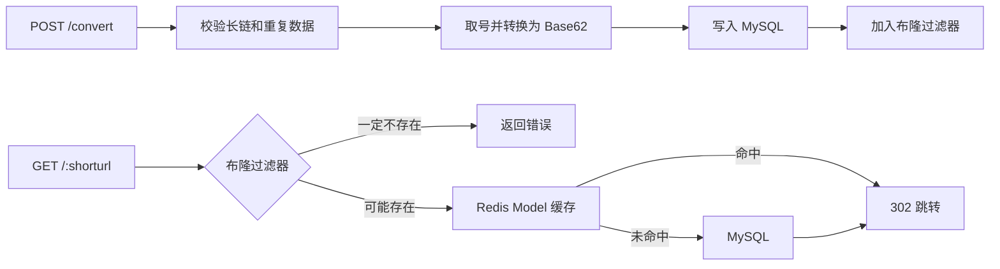

# 长链转短链服务

一个基于 [go-zero](https://go-zero.dev/) 的短链学习项目，支持长链生成、Base62 短码、HTTP 302 跳转、Redis 缓存、布隆过滤器和可替换的取号器。

## 功能

- 将长链接转换为 Base62 短码。
- 访问短码时返回 `302 Found` 并跳转至原始链接。
- 使用 MD5 避免同一长链重复转换。
- 使用黑名单跳过不合适的短码。
- go-zero Model 层自动使用 Redis 缓存。
- 使用 Redis 布隆过滤器拦截一定不存在的短码，减少缓存穿透。
- 支持 MySQL 和 Redis 两种取号实现，业务层统一依赖 `sequence.Sequence` 接口。
- 启动时以每批 1000 条的主键游标分页方式，将历史短码加载到布隆过滤器。

## 请求流程



## 目录结构

```text
.
├── etc/                 # 本地配置
├── internal/
│   ├── config/          # 配置结构
│   ├── handler/         # HTTP Handler
│   ├── logic/           # 业务逻辑
│   ├── svc/             # 共享依赖与布隆过滤器初始化
│   └── types/           # API 请求和响应类型
├── model/               # goctl 生成的带缓存 Model
├── pkg/base62/          # Base62 编码与解码
├── sequence/            # MySQL / Redis 取号器
├── shortener.api        # go-zero API 定义
├── short_url_map.sql    # 长短链映射表
└── sequence.sql         # MySQL 序号表
```

## 运行环境

- Go 1.26.4（以 `go.mod` 为准）
- MySQL 8
- Redis

## 初始化

1. 创建 MySQL 数据库，然后执行建表脚本：

   ```bash
   mysql -u root -p go_zero < short_url_map.sql
   mysql -u root -p go_zero < sequence.sql
   ```

2. 在 `etc/shortener-api.yaml` 写入本地配置：

   ```yaml
   Name: shortener-api
   Host: 0.0.0.0
   Port: 8888

   ShortUrlDB:
     DSN: USER:PASSWORD@tcp(127.0.0.1:3306)/go_zero?charset=utf8mb4&parseTime=true&loc=Asia%2FShanghai

   Sequence:
     Type: mysql
     MySQL:
       DSN: USER:PASSWORD@tcp(127.0.0.1:3306)/go_zero?charset=utf8mb4&parseTime=true&loc=Asia%2FShanghai
     Redis:
       Host: 127.0.0.1:6379
       Type: node
       Pass: ""
       Key: shortener:sequence

   BaseString: 0123456789abcdefghijklmnopqrstuvwxyzABCDEFGHIJKLMNOPQRSTUVWXYZ

   ShortUrlBlackList:
     - convert
     - api
     - health

   ShortDomain: yz1.cn

   CacheRedis:
     - Host: 127.0.0.1:6379
   ```

   `etc/shortener-api.yaml` 已被 `.gitignore` 忽略，请不要提交真实的数据库密码或 Redis 密码。

3. 整理依赖并启动服务：

   ```bash
   go mod tidy
   go run . -f etc/shortener-api.yaml
   ```

## API 示例

创建短链：

```bash
curl -X POST http://127.0.0.1:8888/convert \
  -H 'Content-Type: application/json' \
  -d '{"longurl":"https://www.example.com"}'
```

响应示例：

```json
{"shorturl":"yz1.cn/p"}
```

访问短链：

```bash
curl -i http://127.0.0.1:8888/p
```

成功时返回 `302 Found`，`Location` 响应头指向原始长链。

## 测试

```bash
go test ./...
```

### 本机性能基准

使用 ApacheBench，在 50 并发、5000 次请求、Keep-Alive 开启的条件下测得：

| 路径 | 说明 | QPS | 平均延迟 | P50 | P95 | P99 | 失败请求 |
|---|---|---:|---:|---:|---:|---:|---:|
| `/p` | 有效短链，Redis Model 缓存命中 | 6488 | 7.7 ms | 6 ms | 11 ms | 75 ms | 0 |
| `/not-exist-performance-probe` | 布隆过滤器拦截 | 9665 | 5.2 ms | 4 ms | 10 ms | 22 ms | 0 |

重复测试：

```bash
ab -n 5000 -c 50 -k http://127.0.0.1:8888/p
ab -n 5000 -c 50 -k http://127.0.0.1:8888/not-exist-performance-probe
```

这是本机回环环境的学习性基准，不代表生产环境承载能力。`302` 和当前的错误响应会被 ApacheBench 列为 `Non-2xx responses`，不代表网络请求失败。

## 设计说明

- 布隆过滤器只保证“判定不存在时一定不存在”，判定存在时仍需要查询 Model。
- 布隆过滤器查询失败时，查询逻辑降级到 Model，避免把有效短链误判为不存在。
- `sequence.Sequence` 只暴露 `Next` 方法；短链号可以不连续，但必须唯一。
- MySQL 的 `md5` 和 `surl` 唯一索引是防止重复数据的最终保障。
